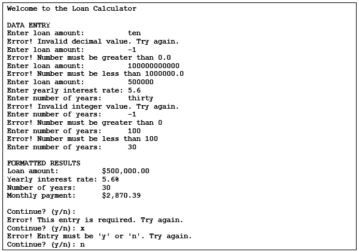

# Java Project - Calculate Monthly Loan Payments

• The Data Entry section prompts the user to enter values for the loan amount, yearly interest rate, and number of years. If the user doesn’t enter data that’s valid, this section displays an appropriate error message and prompts the user again.
• The Formatted Results section displays a formatted version of the user’s entries as well as the formatted result of the calculation.
• The application prompts the user to continue.  

  

***Specifications:***  
• Convert the Yearly Interest Rate to Monthly Interest Rate
• monthlyInterestRate = yearlyInterestRate/12/100
• The formula for calculating monthly payment is:
```double monthlyPayment = loanAmount * monthlyInterestRate / (1 - 1/Math.pow(1 + monthlyInterestRate, months));```
• The application should accept decimal entries for the loan amount and interest rate entries.
• The application should only accept integer values for the years field.
• The application should only accept integer and decimal values within the following ranges:
                       Greater    Less
                       Than       Than
Loan amount:           0          1,000,000
Yearly interest rate:  0          20
Years:                 0          100
• The application should only accept a value of “y” or “n” at the Continue prompt.
• If the user enters invalid data, the application should display an appropriate error message and prompt the user again until the user enters valid data.

